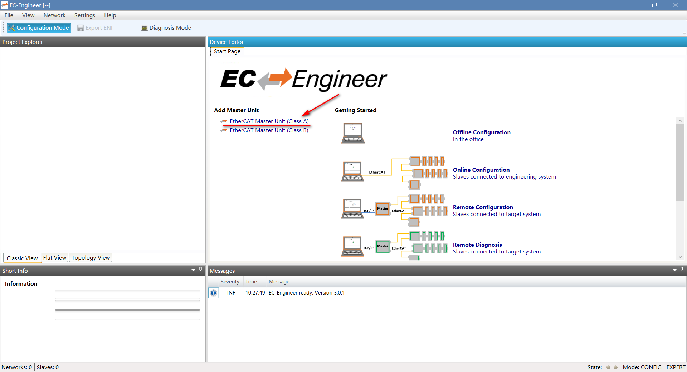
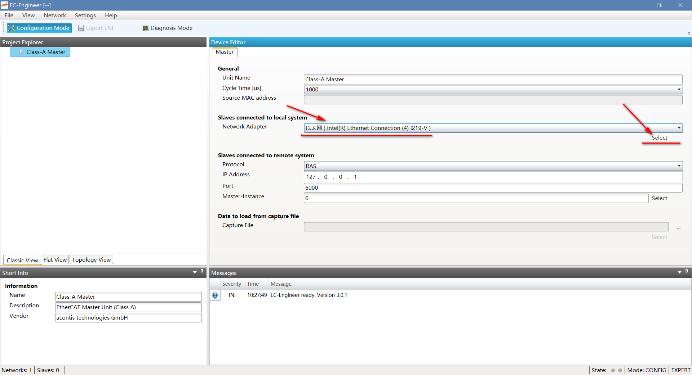
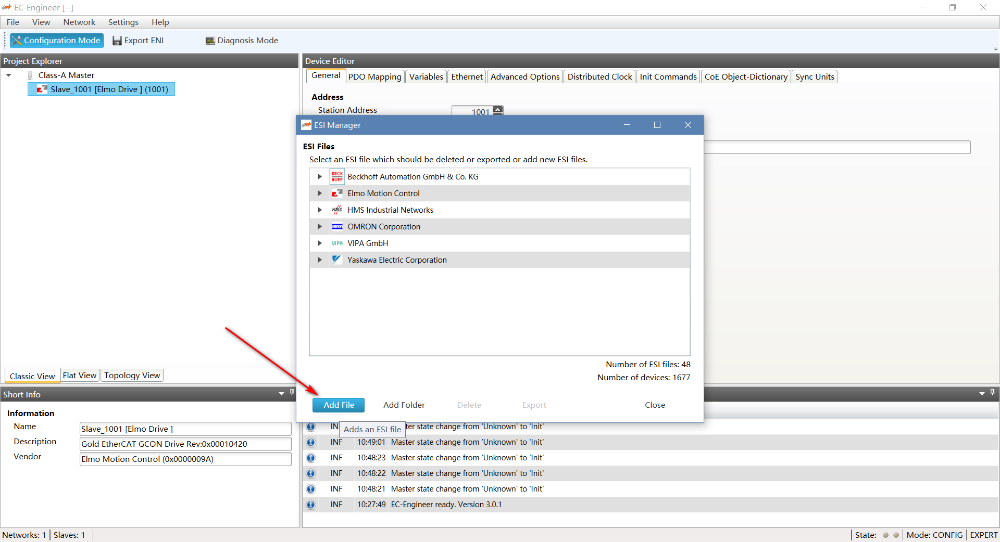
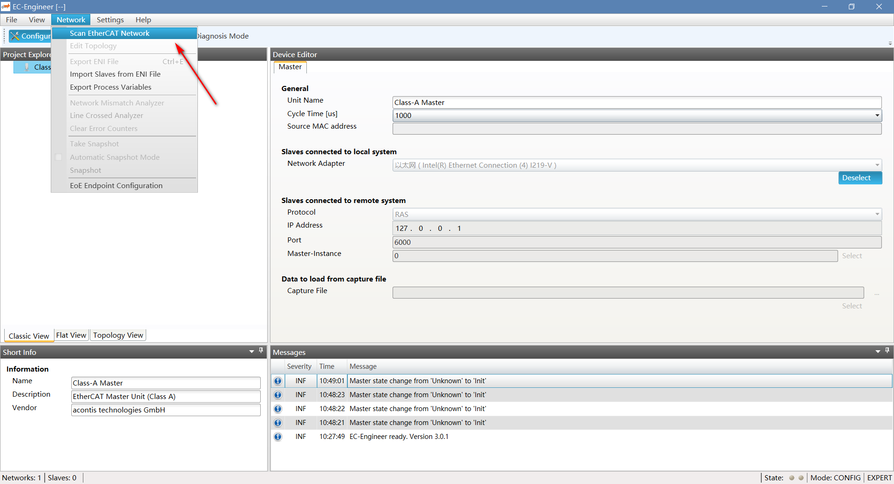
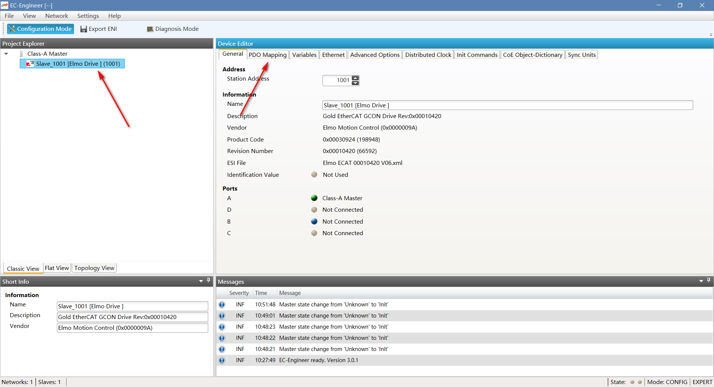
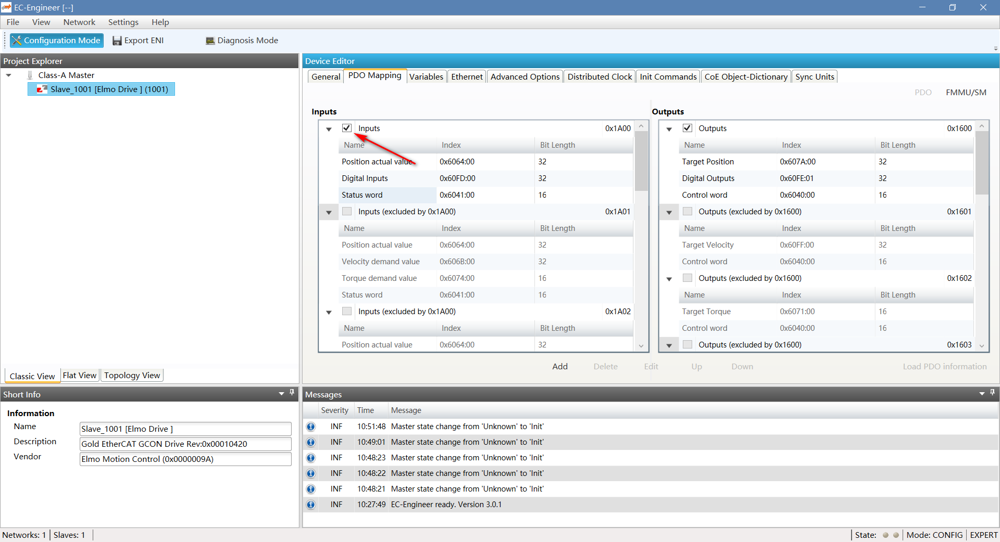
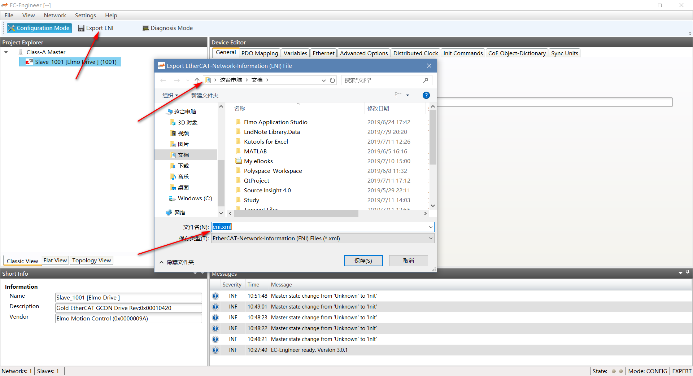
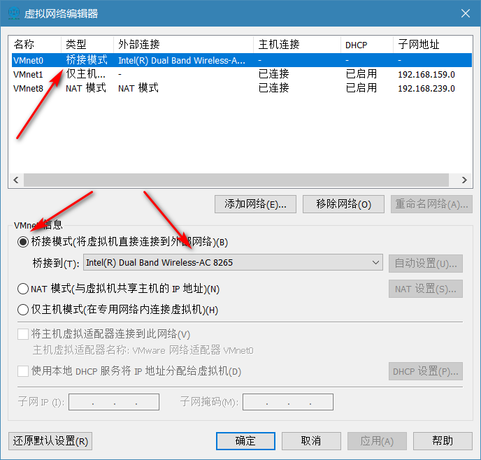

# 基本原理

首先了解一下该程序实现的功能，该程序主要实现的功能有

1. EtherCAT 软主站
2. 通过eni.xml文件实现结构化数据通信自动化

# EtherCat 软主站

软主站的实现，查看系统镜像使用说明文档即可，主要是配置软件环境，运行总线程序即可，运行总线线程之前需要确保主站所用以太网口连接到Elmo驱动器的`input`网卡口，使用`ifconfig`可以查看所有可以上网的网卡口，而作为EtherCAT主站接口的网卡口不显示，使用`sudo ethtool -p ethx`查看向对应的网卡口，在运行总线线程之后如果想要重新启动则需要使用`pkill y2`命令终止线程后，执行`runECM.sh`。在终止线程之前可以使用`ps –ef|grep y2`命令查看是否有该线程。注意：<font color=#FF0000>网卡口的对应关系一定要保准正确 </font>

注意：<font color=#FF0000>在执行su之后的报错是因为`root/.bashrc`下最后一行空格不对</font>

## 结构化数据通信自动化

实际上就是协议的设置

### 驱动器调试

在此之前需要对驱动器进行简单的参数辨识和调试，基本思路是设置完电机参数和编码器参数之后，使用<font color=#FF0000>快速模式</font>调试工具进行参数辨识和调试，之后根据快速辨识出现的问题使用<font color=#FF0000>专家模式</font>针对电流环，位置环，速度环参数进行调整后辨识，其中使用的 EAS（Elmo application studio）具体的详细教程可以去`./驱动器资料`中查找，其中电机和编码器的参数表在`./电机资料`中。驱动器调试与通信无关，只是设置较好的控制器参数。

### 获取驱动器机传递和获取信息的结构化文件eni.xml

在设置好驱动器之后，安装EC Engineer和WinCap，之后使用EC Engineer设置Elmo驱动器的数据传输内容，并且获取数据结构化文件eni.xml，拷贝至软主站目录即可，详细教程如下。

#### 具体EC Engineer使用教程

联网后打开程序，选择Class A



之后选择网卡，点击select



之后需要扫描EtherCAT网络，在扫描网络之前需要加载从站描述文件，在`./系统资料/EC Engineer`文件夹下的`Version 1_1_14_5 B02 Customers`文件夹，选择`*.xml`文件即可。





扫描之后，Project栏就会出现所链接的全部设备，并且展示该网络中的全部的设置，状态字之类的具体细节不需要设置，之后点击驱动器则会出现全部信息，这里只需要针对PDO映射进行调整。



这里的需要根据自己的需求选择驱动器所需的输入输出，其提供了常用的变量组合，也可以自己选择自己所需的变量



设置完毕之后导出eni.xml文件即可



之后需要设置Linux端的EtherCAT软主站的通信，这里只需要将eni.xml 文件拷到`/opt/ECMworkplace`下，运行`runECM.sh`即可，至此软主站与从站通信结束。
注意：文件中命令含义为 : nice -n 20 ./y2 设置线程 `y2` 的优先级为最高, -t8254x 网卡型号, 3 从站个数, 1 主站网口号, -b 1000 运行周期, -v 3, -perf 打印debug, -t 0 运行时间
## 与软主站总线线程通信

将`系统使用说明文档\set_system\SIA_ROBOT\hanbing`配置文件拷贝到Linux系统根目录下

### 总线线程通信设置

打开`\hanbing`文件夹，执行命令`vim busConfig.ini` 将`[ec]`下的参数名改为与eni.xml一样的形式，将其中`[ec_allocation]`的附加轴个数`additionNum`设置为0即可(在不使用附加轴的情况下)，其中`robotNum`为机器人个数，`robotNum/x/Num`为第x个机器人的驱动器个数，这里预先设置为六自由度，如果超出则只需要在`robotNum/x/y=y`后添加`robotNum/x/y+1=y+1`即可。

### 动力学参数设置

打开`\hanbing`文件夹，执行命令`vim kinematicsParameters_r0.ini`，将其中的自由度参数`[dof]`下的`value`变量设置为与`busconfig`一致的大小，而`[0]`代表的是基轴，其他轴`[x]`的动力学参数与末端限值`[endlimit]`看自己的需求而定。

注意：<font color=#FF0000>上述两种参数设置详细的配置见`\系统资料\编程说明文档`下的`机器人控制系统手册v2.0.pdf`中的第三章机器人系统参数配置。</font>

# 编程控制

## eclipse环境配置

### 安装JDK

下载JDK压缩包，将压缩包解压，解压位置随自己而定，我这里选择的是`/opt/`,之后使用命令将Java添加到环境中,我选择的方法是将以下命令加入到`/etc/profile`的末尾。

```shell
export JAVA_HOME=/opt/jdk1.8.0_212
export JRE_HOME=$JAVA_HOME/jre
export CLASSPATH=.:$JAVA_HOME/lib:$JRE_HOME/lib:$CLASSPATH
export PATH=$JAVA_HOME/bin:$JRE_HOME/bin:$PATH
```

可使用`source /etc/profile`立即生效，重启后也可生效。

之后将eclipse解压，直接运行即可。之后直接导入工程即可，如果出现了乱码，右击文件属性修改编码格式即可，但不一定成果。

## sublime破解办法

将sublime解压，打开[HexEdit](https://hexed.it/)网站，打开解压后文件夹中的`sublime_text`，将其中的`97 94 0D 00`修改为`00 00 00 00`保存之后修改权限即`chmod 755 sublime_text`。

同时需要屏蔽hosts，使用`vim /etc/hosts`，在hosts文件中加入以下内容

```shell
127.0.0.1 license.sublimehq.com
127.0.0.1 www.sublimetext.com
50.116.34.243 sublime.wbond.net
50.116.34.243 packagecontrol.io
```

运行sublime，点击help后enter license如下：

```
----- BEGIN LICENSE -----
TwitterInc
200 User License
EA7E-890007
1D77F72E 390CDD93 4DCBA022 FAF60790
61AA12C0 A37081C5 D0316412 4584D136
94D7F7D4 95BC8C1C 527DA828 560BB037
D1EDDD8C AE7B379F 50C9D69D B35179EF
2FE898C4 8E4277A8 555CE714 E1FB0E43
D5D52613 C3D12E98 BC49967F 7652EED2
9D2D2E61 67610860 6D338B72 5CF95C69
E36B85CC 84991F19 7575D828 470A92AB
------ END LICENSE ------
```

# 编程

demo中的控制采取的是新建控制线程实现的，为了方便测试选择修改控制函数，修改的工程文件见`project`文件夹下的`UserProject.tar.gz`。


其中`testfunction`是根据自己修改的控制函数，函数`PthControlF` 中的`torqueTimerE`语句是为了保证控制周期为`1 ms`；

常用的机器人控制函数(<font color=#FF0000>单轴控制函数及其他控制函数详见`RobotEtherCAT.h`文件</font>)如下：

```c
char* EtherCAT_name = getEC_deviceName(0,NULL); //获取主站名称
char* robot_name=get_name_robotEC_deviceHandle_c(EtherCAT_name,0); //获取机器人名称
int dof=getRobotDOF_c(robot_name); //获取自由度
robot_setmode_c(robot_name,turn_mode); //设置位置(8)速度(9)力矩(10),turn_mode是自由度长度的数组
robot_power_c(robot_name); //上电
robot_poweroff_c(robot_name); //下电
robot_setposition_c(robot_name,position); //设置位置
robot_getposition_c(robot_name,position); //得到位置
robot_setvelocity_c(robot_name,velocity); //设置速度
robot_getvelocity_c(robot_name,velocity); //得到速度
```

# 与工控机通信

我这里使用的是虚拟机，所以需要虚拟网络编辑器修改一下桥接模式的网络设置，其中桥接到的网卡是Windows端与工控机通信的网卡。



现需要对网卡的IP进行设置，我这里选择设置为静态IP`192.168.0.100`。可通过对`/etc/network/interfaces`文件内容进行修改，添加以下内容

```shell
auto eth1
#iface eth1 inet dhcp #将动态IP注释掉
iface eth1 inet static
address 192.168.0.100
netmask 255.255.255.0
gateway 192.168.0.1
```

之后执行`sudo /etc/init.d/networking restart`重启网络即可。之后需要修改Windows端网卡的IP设置为静态IP`192.168.0.101`。

默认系统是开启SSH服务的，使用`ssh sia@192.168.0.99`远程登陆工控机，同时demo中附带了`sshCpyLib.sh`可以直接运行将本地编译生成的可执行文件和动态库拷贝到工控机端，在拷贝之前需要在工控机端创建`/robot`文件夹。在工控机端直接运行`/robot/RobotMain`即可控制驱动器驱动电机。

同时注意如果只是想使用EtherCAT主站进行通信，不考虑限值，机器人运动学等工具的使用时，只需使用带参运行主程序即可：`/robot/RobotMain --EtherCATonly on`。注意：<font color=#FF0000>这里对于我们来说一般选择此命令，因为其内部有很多控制机制，比如限值，我们都不需要或者想要实现限值控制的效果与其实际效果不同。</font>
